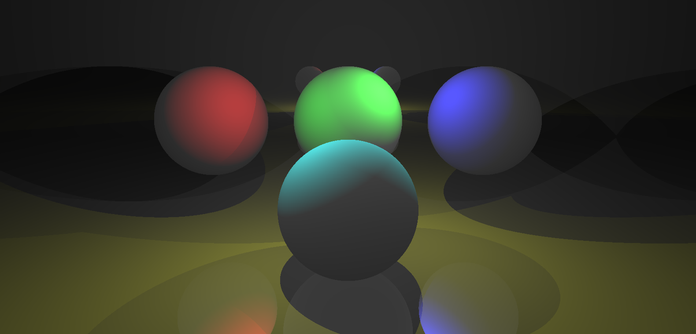

# Raytracing Demo

A simple software raytracer that traces a static scene and displays it using OpenGL. Traces a simple scene recursively without transparency.

Rendered Image:

## TODO

Move raytracing code to GPU (inside shader), add transparency/refraction.